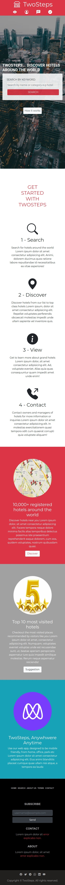

# Microverse HTML & CSS Captstone Project
## TwoSteps, A Directry of International Hotels
### [Solo Project]

> Responsive Web Design Project built with HTML & CSS, Bootstrap, Git and Github

This project involves building a responsive, mobile first, Hotel directory called TwoSteps. This history directory enables a user to find hotels around the world. The web app displays the details of a registered hotel in two simple steps by 1.) entering a search criteria and 2.) selecting a hotel from the list of search results. The name of the app is derived from the number of actions (two steps) required to land on a hotel's page.

TwoSteps is a project based on [PatashuleKE](https://www.behance.net/gallery/25563385/PatashuleKE) designed by Matthew Njuguna and Sam Achola. "Patashule is a web app that bridges the gap between schools and parents" (Behance). In a similar way, twosteps bridges the gap between people on transit and hotels around the world.

The project demonstrates all the technical skills learnt in the Microverse HTML 2.0 curriculum:

- Setting up a new project and professional README file
- Positioning and Floating Elements
- Using forms
- Building with Responsive Design
- Working Bootstrap and
- Using transitions and animation

## Built With

- HTML and CSS
- Bootstrap v5.0
- git and github
- google fonts
- bootstrap icons

## Live Demo

[Live Demo Link](https://francisuloko.github.io/html-css-capstone-proj/)

## Clone Repo

To get a local copy up and running follow these simple steps:

Open terminal or command line and run the following commands:

   - `git clone git@github.com:francisuloko/html-css-capstone-proj.git`

   - `cd html-css-capstone-proj`

Open index.html in the project :root directory using live server
   
   - `Right Click or ALT+L ALT+O`

## Prerequisites

- `browser`
- `vscode`
- `git`

## Author

👤 **Francis Uloko**

- GitHub: [@francisuloko](https://github.com/francisuloko)
- Twitter: [@francisuloko](https://twitter.com/francisuloko)
- LinkedIn: [@francisuloko](https://linkedin.com/in/francisuloko)

## 🤝 Contributing

Contributions, issues, and feature requests are welcome!

Feel free to check the [issues page](issues/).

## Show your support

Give a ⭐️ if you like this project!

## Acknowledgments

- Microverse Inc.
- Coding Partner, Carlos Osorio
- My StandUp Team
- Matthew Njuguna & Sam Achola
- [Pexels](https://www.pexels.com/)

## 📝 License

This project is [MIT](lic.url) licensed.

<h1></h1>

Copyright &copy; 2021. All rights reserved.

